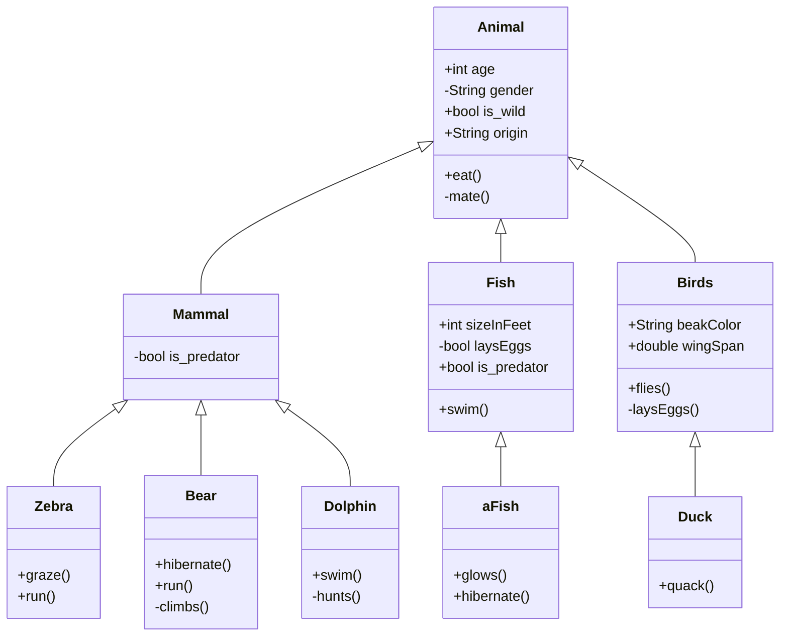

# A simple introduction to c#.

## sample class diagram
Testing Mermaid diagram tool 

```mermaid
classDiagram
    Animal <|-- Mammal
    Animal <|-- Fish
    Animal <|-- Birds

    Birds <|-- Duck
    Fish <|-- aFish
    Mammal <|-- Zebra
    Mammal <|-- Bear
    Mammal <|-- Dolphin

    
    Animal : +int age
    Animal : -String gender
    Animal : +bool is_wild
    Animal : +String origin
    Animal : +eat()
    Animal: -mate()


    Mammal: -bool is_predator
    
    Fish: +swim()
    Fish: +int sizeInFeet
    Fish: -bool laysEggs
    Fish: +bool is_predator

    Birds: +flies()
    Birds: +String beakColor
    Birds: +double wingSpan
    Birds: -laysEggs()


    
    class Duck{
        +quack()
    }

    class aFish{
        +glows()
        +hibernate()
    }
    
    class Zebra{
      +graze()
      +run()
    }

    class Bear{
        +hibernate()
        +run()
        -climbs()
    }

    class Dolphin{
        +swim()
        -hunts()
    }

```